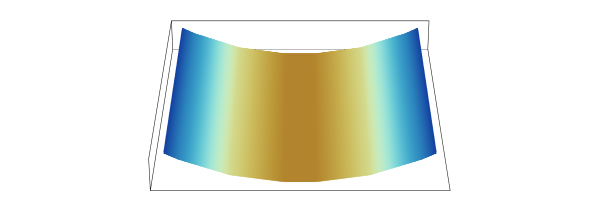

# Membrane ALE FEM

**MembraneAleFem.jl** solves the continuum equations governing the dynamics of a
lipid membrane, using an arbitrary Lagrangian--Eulerian (ALE) finite element
method (FEM).
In doing so, the surface is discretized and endowed with a mesh whose material
behavior and dynamics are arbitrarily specified by the user.
The fundamental unknowns are then the material velocity ``\boldsymbol{v}``, mesh
velocity ``\boldsymbol{v}^{\text{m}}``, and surface tension ``\lambda``—the
latter of which is a Lagrange multiplier that enforces areal incompressibility.
Since the mesh motion is arbitrarily specified, we employ another Lagrange
multiplier—referred to as the mesh pressure ``p^{\text{m}}``—to enforce the ALE
kinematic constraint
```math
\big(
	\boldsymbol{v}
	\, - \, \boldsymbol{v}^{\text{m}}
\big) \boldsymbol{\cdot} \boldsymbol{n}
\, = \, 0
~,
```
where ``\boldsymbol{n}`` is the unit normal to the surface.
Finally, the position ``\boldsymbol{x}`` of the membrane surface is parametrized
by the two coordinates $\zeta^\alpha$, and determined at the time $t$ from the
mesh velocity according to
```math
\boldsymbol{x} (\zeta^\alpha, t)
\, = \, \boldsymbol{x} (\zeta^\alpha, 0)
\, + \, \int_0^t \boldsymbol{v}^{\text{m}} (\zeta^\alpha, t') ~ \text{d} t'
~.
```
Note that here and from now on, $\alpha$ and other Greek indices span the set
{1, 2}.
For those also referring to the associated
[manuscript](https://arxiv.org/pdf/2412.07596),
in this documentation we drop the 'check' accent over Greek indices for
notational convenience.

In employing finite element analysis, we discretize both the temporal and
parametric domains.
At the time ``t_n`` of the ``n^{\text{th}}`` time step, we solve for the
finitely many degrees of freedom corresponding to the discretized mesh.
Details of our numerical implementation are provided in the
[manual](man/overview.md).


## [Citation](@id man-cite)

If you use MembraneAleFem.jl in your work, please reference the following
[article](https://arxiv.org/pdf/2412.07596)

```code
@article{sahu-arxiv-2024,
  author  = {A. Sahu},
  title   = {{Arbitrary Lagrangian--Eulerian finite element method for lipid membranes}},
  journal = {arXiv preprint},
  year    = {2024},
  eprint  = {2412.07596},
  url     = {https://arxiv.org/abs/2412.07596},
  archivePrefix={arXiv},
}
```


## [Installation](@id man-install)

Open the Julia REPL, for which you should see the prompt `julia>`.
Then type the following:
```code
using Pkg; Pkg.add(MembraneAleFem)
using MembraneAleFem
```


## [Usage](@id man-usage)

To solve a particular [`Scenario`](@ref), one chooses appropriate
[`Parameters`](@ref man-params) and also specifies scenario-specific keyword
arguments.
The requisite arguments are listed in
[`check_params`](@ref MembraneAleFem.check_params).
In what follows, examples of (1) pure bending and (2) tether pulling are
provided.
In all cases:

- open the Julia REPL
- at the prompt `julia> `, enter
```
using MembraneAleFem
```

### Plotting

There are many ways to plot the calculated results.
In the examples presented below, we assume the following has been entered in the
REPL:

```code
using DelimitedFiles, GLMakie, LaTeXStrings
GLMakie.activate!();
set_theme!(theme_latexfonts());
```


### 1. Pure bending

- **Calculations**

```code
p = Params(motion=LAG, scenario=F_BEND, num1el=2, num2el=2, length=1.);
mesh, xms, cps = solve(p; bend_tm=2.0, bend_mf=0.5,
                       t0=0, t0_id=0, Δts=[0.5 for i=1:16],
                       out_path=".", out_file="out.txt");
```


- **Plotting**

Data files are saved, and can be used to generate a video.
Here, we present one way to visualize the final frame from the REPL.
The surface color is the error in the surface tension, multiplied by 100.

```code
xout, uout = generate_output(mesh, xms, cps);

fig  = Figure(size=(800, 600));
ga   = fig[1,1] = GridLayout();
ax   = Axis3(ga[1,1], aspect = :data, perspectiveness = 0.2,
           elevation = 0.5, azimuth = π/2, protrusions = -0);
surf = surface!(ax, xout[:,:,1], xout[:,:,2], xout[:,:,3],
           color = uout[:,:,mesh.dofs[Dof.λ]] .* 10^2 .- 0.25*10^2,
           colorrange = (-2.0, 2.0), colormap = :roma, shading = NoShading);

hidedecorations!(ax);
fig
```




### 2. Tether pulling

- **Calculations**

```code
p = Params(motion=LAG, scenario=F_PULL, num1el=19, num2el=19, length=16.);
mesh, xms, cps = solve(p; pull_speed=0.5,
                       t0=0, t0_id=0, Δts=[0.5 for i=1:32],
                       out_path=".", out_file="out.txt");
```


- **Pull force**

```code
f_pull_data = readdlm("f-pull.txt");
tether_z = f_pull_data[2:end,4];
tether_f = f_pull_data[2:end,7];
scatter(tether_z, tether_f, markersize=15, color=RGBf(0.75, 0.34, 0.0),
    figure=(;fontsize=32, size=(800, 650)),
    axis=(; limits = (0, 8, 0, 6.8), aspect=1.2, title="Pull Force",
          xlabel=L"z_{\text{p}}/r_{\text{c}}",
          ylabel=L"\mathcal{F}/(k_{\text{b}}/r_{\text{c}})"))
```


- **Restart example**

To continue tether pulling from its last saved state, run the following code.

```code
mesh, xms, cps = restart("params.dat", "args.dat";
                         in_path=".", t0=16.0, t0_id=32, Δts=[0.5 for i=1:12]);
```


### 3. Additional examples

For the following [`Scenario`](@ref)s, we provide only the code to run the
calculations; solutions can be plotted by modifying the code above.


- **Couette flow**

```code
p = Params(motion=STATIC, scenario=F_COUE, length=1.0);
mesh, xms, cps = solve(p; t0=0, t0_id=0, Δts=[1.0], out_path=".", out_file="out.txt");
```


- **Poiseuille flow**

```code
p = Params(motion=STATIC, scenario=F_POIS, length=1.0);
mesh, xms, cps = solve(p; t0=0, t0_id=0, Δts=[1.0], out_path=".", out_file="out.txt");
```


- **Lid-driven cavity flow**

```code
p = Params(motion=STATIC, scenario=F_CAVI, length=1.0);
mesh, xms, cps = solve(p; t0=0, t0_id=0, Δts=[1.0], out_path=".", out_file="out.txt");
```


## [Manual Outline](@id man-outline)

- [Overview](@ref man-overview)
- [Input](@ref man-input)
- [Analysis](@ref man-analysis)
- [Output](@ref man-output)


## [References](@id man-references)

```@bibliography
*
```


